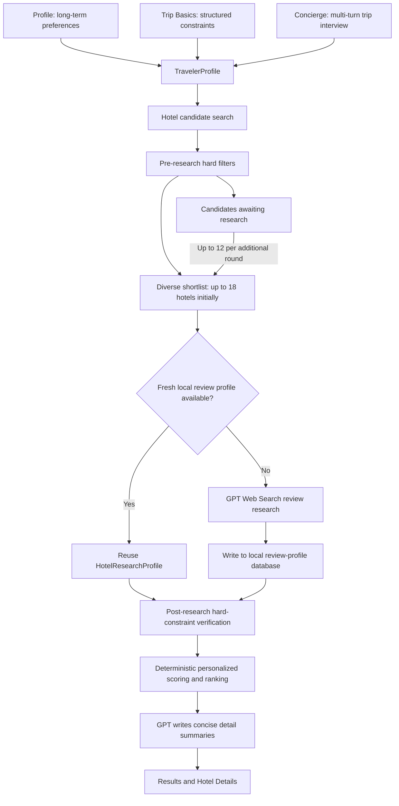

# Staylight Project Logic

This document describes the current Staylight architecture, data flow, module boundaries, and key design decisions. It reflects the implementation in this repository and is intended to support continued development, candidate-count debugging, and onboarding.

## 1. Product Goal and System Boundary

Staylight is not a hotel search tool that sorts only by rating. It separates hotel decisions into three kinds of information:

- **Long-term preferences**: Factors the user usually values, such as value for money, review score, quietness, location, and custom weighted priorities.
- **Trip basics**: Destination, dates, number of guests, number of rooms, maximum price per room per night, accommodation type, and minimum rating.
- **Trip-specific requirements**: Temporary needs, must-haves, explicit deal breakers, and risk priorities gathered through a multi-turn conversation.

The system first narrows the candidate set with verifiable structured constraints, then researches review evidence for a subset of those candidates. Deterministic rules produce the final ranking. GPT understands natural language, researches public review information, and writes concise explanations, but it cannot override budget, accommodation type, minimum rating, or explicit deal breakers.

## 2. Architecture Overview



Runtime boundaries:

- The browser manages UI state, stores long-term preferences, and calls local API routes.
- Next.js Route Handlers validate requests, call external services, run deterministic rules, and manage the file cache.
- OpenAI and SerpApi keys are read only from server-side environment variables.
- Hotel review profiles are stored locally in `.staylight-data/hotel-profiles.json` by default.

## 3. Core Data Objects

Shared domain types are defined in `lib/types.ts`.

| Object | Purpose | Main source |
| --- | --- | --- |
| `UserPreferences` | Stable hotel preferences and 1-5 weights | Profile screen and browser `localStorage` |
| `TripBasics` | Directly entered constraints for the current trip | Structured controls on the Trip screen |
| `TravelerProfile` | Complete merged search and matching criteria | Trip Basics, long-term preferences, and conversation results |
| `HotelCandidate` | Search-stage hotel, prices, and known evidence | Sample data or SerpApi |
| `HotelResearchProfile` | Reusable hotel review profile | Local cache or OpenAI Web Search |
| `HotelRecommendation` | Rule score, fit reasons, risks, and detail summary | Rule engine and GPT summary generation |

`TravelerProfile` is the central input for one search. Changing dates, guest count, room count, or budget updates the structured fields without resetting the existing conversation or extracted requirements. The user must run the search again to refresh results.

## 4. End-to-End Business Flow

### 4.1 Long-Term Preferences

The Profile screen manages `UserPreferences`:

- Value for money, review score, quietness, and location use 1-5 weights.
- Users can add custom long-term priorities and assign a weight to each one.
- Data is stored in the browser under `staylight-user-preferences`.
- `applyPreferences()` merges important long-term preferences into the current `TravelerProfile`, so the interview does not need to ask for them on every trip.

Long-term preferences normally influence soft scoring. A condition becomes a hard exclusion only when the user explicitly identifies it as a deal breaker for the current trip or when the selected accommodation type makes the property ineligible.

### 4.2 Trip Basics

The user selects or enters the following values directly. The LLM does not infer them:

- Destination
- Check-in and check-out dates
- Number of adults and rooms
- Maximum price per room per night
- Accommodation type: hotel, hostel, or any
- Minimum aggregate rating

This reduces language ambiguity and lets Sample and Live modes use the same structured filtering logic.

### 4.3 Multi-Turn Requirements Interview

`POST /api/profile` maintains three phases:

1. `collecting`: Ask exactly one useful trip-specific question per turn.
2. `final_check`: Ask whether the user has any additional requirements.
3. `confirmed`: Unlock search only after the user explicitly says there is nothing else to add or actively finishes the interview.

Sample mode uses controlled keyword extraction from `lib/requirements.ts`. Live mode asks OpenAI for a structured `TravelerProfile`. Meaningful requirements extracted from the conversation enter must-haves, deal breakers, or risk priorities. Users can delete a risk priority, and dismissed priorities are not reintroduced from older messages during the same trip.

### 4.4 Hotel Candidate Search

`POST /api/hotels/search` supports two data sources:

- **Sample**: 18 local hotel snapshots across Tokyo, Copenhagen, and Paris, with 6 hotels per city.
- **Live**: Google Hotels results through SerpApi. The route requests up to 3 pages or 60 raw properties, deduplicates them, and maps prices, provider links, amenities, and basic review evidence.

Live mode returns up to 40 unique candidates that survive the initial filters. Budget filtering uses the lowest valid nightly offer across all available providers for each hotel, not only a single official-site price.

`searchStats` records the fetched count, unique count, and counts remaining after deal-breaker, accommodation-type, budget, and rating filters. These values explain why the candidate set becomes smaller.

### 4.5 Pre-Research Hard Filters

Hard filters run in this order:

1. Explicit deal breakers
2. Accommodation type
3. Maximum price per room per night
4. Minimum rating

Hard constraints are never relaxed automatically. If Live search returns no eligible hotels or an external service fails, the app displays the limitation instead of silently substituting Sample hotels.

| Condition | Treatment |
| --- | --- |
| Lowest available price exceeds the maximum budget | Hard exclusion |
| Rating is below the selected minimum | Hard exclusion |
| Hotel-only search returns a hostel, shared-bathroom property, or another known non-hotel form | Hard exclusion |
| Known evidence conflicts with an explicit deal breaker | Hard exclusion |
| Quietness, location, cleanliness, and similar priorities | Soft score and risk explanation by default |
| Review evidence is missing | Keep the candidate with lower confidence; do not assume compliance |

### 4.6 Batched Review Research

The system does not research every candidate immediately after hard filtering:

- `selectHotelsForResearch()` starts with rule-based scores and preserves area and price diversity.
- The initial research round includes up to 18 hotels.
- Other eligible candidates enter `remainingHotels`.
- The Analyze more hotels action researches up to 12 additional hotels per round and merges them into the existing results.
- One `/api/hotels/research-batch` request accepts at most 24 hotels. The default research concurrency is 3, with an enforced maximum of 4.

As a result, seeing 10 candidates but only 4 visible matches is not necessarily a pagination defect. Four candidates may have survived review verification, while others appear under Removed after review verification or remain Awaiting review. The interface should use these three counts to account for every initially eligible candidate.

### 4.7 Review-Profile Cache

`POST /api/hotels/research-batch` builds a normalized cache key from `hotel name + area + destination`, then follows this sequence:

1. Fresh cache hit: Reuse the profile with status `cached`.
2. Stale cache hit: Keep the previous evidence with status `stale` and attempt fresh research.
3. No cache and OpenAI is available: Use Web Search to create a profile with status `fresh`.
4. No usable profile and research is unavailable: Keep the base hotel data with status `unavailable`.

A review profile contains positive themes, recurring low-score issues, aspect-level evidence, source links, model information, and expiration dates. The default time-to-live is 30 days. `STAYLIGHT_RESEARCH_TTL_DAYS` can change it up to a maximum of 90 days. Writes use a temporary file followed by an atomic rename to avoid leaving a partially written JSON file.

### 4.8 Post-Research Verification and Ranking

Review research may reveal facts that were absent from search summaries, such as shared bathrooms, recurring noise, or persistent cleanliness complaints. `rankHotelsByRules()` therefore verifies hard constraints again using the enriched evidence:

- If new evidence conflicts with the accommodation type or an explicit deal breaker, the hotel is removed from recommendations.
- Eligible hotels receive a deterministic fit score, fit label, fit reasons, risk flags, and evidence confidence.
- GPT cannot change the fit score or restore a hotel that failed a hard constraint.

Hotel Details organizes evidence into:

- **Specific for you**: Matches and uncertainties directly related to trip requirements and long-term preferences.
- **Watch-outs**: Recurring problems extracted from low-score reviews and the stored research profile.
- **Prices**: Nightly prices and links for multiple providers. Results show the lowest price and its provider.

### 4.9 GPT Detail Summary

`POST /api/hotels/analyze` runs deterministic rules before sending the rule results and supplied evidence to GPT. GPT rewrites only `detailSummary` as a concise natural-language explanation covering:

- Why the hotel matches the user's priorities.
- What remains unconfirmed and may require contacting the hotel.
- No redundant budget explanation.

If no OpenAI key is available, the model returns invalid structured output, or the request fails, the system uses `buildFallbackDetailSummary()`. Candidate eligibility and rule scores remain unchanged.

## 5. Candidate States

The frontend maintains three result groups in `app/page.tsx`:

| UI state | Frontend data | Meaning |
| --- | --- | --- |
| Verified matches | `recommendations` | Researched, verified, and ranked |
| Removed after review verification | `excludedHotels` | Passed initial filters, but enriched review evidence triggered a hard conflict |
| Awaiting review | `remainingHotels` | Passed initial filters but has not entered a research batch |

`hotels` stores researched candidate data used by Hotel Details. Additional rounds deduplicate and merge new records. A failed additional round does not discard previously verified results.

## 6. API Responsibilities

| Route | Primary responsibility | External service use |
| --- | --- | --- |
| `POST /api/profile` | Multi-turn interview, requirement extraction, and preference merge | OpenAI in Live mode |
| `POST /api/hotels/search` | Candidate discovery, provider-price mapping, and initial hard filtering | SerpApi in Live mode |
| `POST /api/hotels/research-batch` | Cache lookup, review research, and profile persistence | OpenAI Web Search on cache miss |
| `POST /api/hotels/analyze` | Deterministic ranking and detail-summary generation | OpenAI when a key is available |
| `GET /api/status` | Return capability booleans without key values | None |

All write routes validate request structures with Zod. External calls and secret access remain inside Route Handlers and never execute in the browser.

## 7. Directory and Module Map

```text
app/page.tsx                           UI, navigation, and client-side flow orchestration
app/api/profile/route.ts               Multi-turn requirements interview
app/api/hotels/search/route.ts         Sample/Live candidate search and initial filtering
app/api/hotels/research-batch/route.ts Review-profile cache and batched research
app/api/hotels/analyze/route.ts        Rule-based ranking and GPT detail summaries
app/api/status/route.ts                Local capability check
lib/types.ts                           Shared domain types
lib/preferences.ts                     Long-term preference normalization and merge
lib/requirements.ts                    Meaningful requirement keyword extraction
lib/rule-engine.ts                     Hard filters, scores, ranking, and shortlist diversity
lib/hotel-evidence.ts                  Live search evidence normalization
lib/hotel-research.ts                  OpenAI Web Search review research
lib/hotel-profiles.ts                  Profile keys, freshness, and candidate enrichment
lib/hotel-profile-store.ts             Local JSON review-profile database
lib/provider-links.ts                  Provider price links
lib/sample-data.ts                     Repeatable offline demonstration data
lib/trip.ts                            Date, night-count, and budget formatting
lib/prompts.ts                         OpenAI instructions and summary context
tests/                                 Rule, evidence, requirement, and link tests
```

## 8. Sample and Live Mode Differences

| Capability | Sample | Live |
| --- | --- | --- |
| Destinations | Tokyo, Copenhagen, and Paris | Any destination supported by SerpApi |
| Candidate data | Local snapshots | Google Hotels through SerpApi |
| Interview | Local keyword rules | OpenAI structured output |
| Review profile | Local candidate evidence; cache first, with optional OpenAI research | Cache first, then OpenAI Web Search on a miss |
| Prices | Demonstration estimates | Current multi-provider search offers |
| External failure strategy | Preserve a repeatable demonstration | Report the failure without substituting Sample data |

## 9. Security and Privacy

- Store `OPENAI_API_KEY` and `SERPAPI_API_KEY` only in `.env.local`. Never commit that file.
- The browser stores long-term preferences, not API keys.
- `/api/status` exposes only whether a capability is configured, never the key value.
- Review profiles stay on the user's machine. `STAYLIGHT_DATA_DIR` can redirect the storage directory.
- The current profile cache is a single-machine JSON store suitable for a local-first early product. It is not designed for concurrent writes from multiple application instances.

## 10. Failure and Fallback Principles

- Live search failure: Stop and explain the cause without relaxing constraints or substituting Sample data.
- Review research failure: Keep structured search evidence and mark it `unavailable`, or use a `stale` profile when available.
- GPT summary failure: Use deterministic local copy.
- Additional research failure: Preserve previously verified results.
- No hotels satisfy budget or hard constraints: Return an empty result with the filtering limitation instead of including ineligible hotels.

## 11. Current Limitations and Extension Points

- Hotel identity currently uses a combination of name, area, and destination. Renamed properties, duplicate names, or changing area labels may create duplicate profiles. A stable provider property ID should become the preferred identity when available.
- Live coverage depends on Google Hotels and SerpApi pagination, regional parameters, and provider inventory. It does not represent every hotel in the market.
- The local JSON cache has no cross-device synchronization, full-text index, or version history. A larger product could move it to SQLite or Postgres while preserving the `HotelResearchProfile` contract.
- Review profiles aggregate public web evidence and should not be described as a statistically complete sample of reviews from every platform.
- Additional research is currently user-triggered. Future versions could add a background queue, progress reporting, and risk-prioritized evidence collection.
- A per-search filtering audit trail could show the exact rule that removed each hotel.

## 12. Local Run and Verification

```bash
./start-local.sh
```

The default URL is `http://127.0.0.1:3003`. Use `PORT=3000 ./start-local.sh` to select another port.

Run the complete verification suite with:

```bash
npm run lint
npm run typecheck
npm test
npm run build
```

When changing search, research, or ranking behavior, add focused rule tests and confirm that the Verified, Removed, and Awaiting counts add up to the number of candidates that passed initial filtering.
